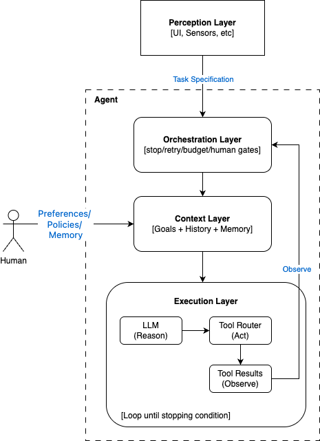

# AI Agents

An AI Agent is a system that uses a language model—often called a **reasoning engine** in product language—as its **control policy**: it autonomously pursues a goal by taking actions, observing results, and deciding what to do next in a loop. In practice, **reasoning** means step-by-step generation over context (plans, rationales, tool choices), not a verified logic engine or guaranteed correctness.

The key word is **autonomously**. A regular LLM interaction is a single turn: you ask, it answers. An agent is different because it can:

**Plan** — break a goal into steps
**Act** — use tools (search the web, run code, call APIs, read/write files)
**Observe** — receive the result of that action
**Reason** — decide what to do next based on the result
**Repeat** — continue until a **stopping condition** is met (e.g. goal reached, step or token budget exhausted, or explicit human approval), depending on design

## Key Characteristics and Capabilities

- **Autonomy:** Agents can operate independently to complete multi-step workflows after being given a goal.
- **Tool Use:** They can interact with external software, APIs, and databases to perform tasks, such as updating a CRM or booking a flight.
- **Reasoning & Planning:** Agents use LLMs to break tasks into steps and choose **tool types** from a curated set. Tool **arguments** can still be open-ended (natural language, JSON, code), so validation and guardrails matter. Some designs use **code as an action** inside a sandbox; the bound is then policy and environment, not a short list of operation names. The model steers by learnt patterns, not formal logic.
- **Memory:** Agents keep **working context** for multi-turn work—often session-scoped chat history. **Longer-term memory**, when you need it, is implemented **outside** the model (database, vector store, CRM, files), not in the weights; that is what makes “remember my usual flight” possible across sessions.
- **Learning:** Most production agents do NOT learn or adapt during operation. Their behaviour is determined by:
  - The underlying LLM (which is fixed after training)
  - System prompts and tool definitions (which are static)
  - Conversation context (which resets each session)

**Note:** Some advanced systems may log interactions for offline analysis and prompt refinement, but this is not real-time learning.

## Components of an AI Agent

### LLM as Decision Engine

Agents use LLMs to:

1. **Classify user intent** - Map natural language to predefined action categories
2. **Extract parameters** - Identify relevant values (dates, locations, etc.)
3. **Select actions** - Choose which tool to invoke from a curated set of tool types (arguments may be flexible)
4. **Generate responses** - Communicate results in natural language

The LLM acts as a probabilistic classifier/router, mapping unstructured user input to structured tool calls. **Tools** are ordinary software you implement: you can make them repeatable and validated, but if they call **networks, time, or shared services**, outcomes may still be non-deterministic end-to-end.

**Engineering stance:** Do not assume the model is always correct. For high-stakes flows, **validate** tool arguments, enforce **allowlists**, require **human confirmation** for irreversible actions, and treat visible “reasoning” as **audit text**, not proof.

### Perception

Gathering data from user prompts or external environments.

### Action/Tools

Using software capabilities to execute tasks.

## AI Agent Architecture

A high-level runtime architecture for LLM-based agents (one common pattern):



*In some systems, tool selection is direct from the model without a separate router.  
Observe feeds orchestration, which then updates next-step context and decisions (stop, retry, escalate, or continue).*
Some implementations write observations directly to context; here we depict orchestration-mediated feedback for control and safety.

### 1. Context Layer — what the model sees at each step

- Original goal and constraints
- Conversation and action history
- Tool or retrieval results from prior steps
- Any injected memory, documents, or policy instructions

**Where preferences fit:** Preferences (and policies) are *standing instructions* about how the agent should behave (tone, risk tolerance, working hours, default formats, “always ask before spending money”). They are not the immediate task request. In this architecture they are injected into the **context layer** each step (often sourced from external storage) and can also influence orchestration gates (for example, requiring confirmation before writes).

At each step, the model only sees what is in the current context window. The wider agent system can still hold additional state externally (database, vector store, cache, queue), but that state only affects behaviour when surfaced into context or accessed through tools.

### 2. Execution Layer — what the model can do

- Tool definitions (schemas the model can call)
- Tool runners (the actual code that executes them)
- Tool-call interface and validation (schema checks, coercion, safety validation)

### 3. Orchestration Layer — what governs the loop

When to stop (max steps, goal detection, human approval)
Error handling and retries
State management between steps
Whether to run sub-agents

### Simple example — how an task specification is transformed through the layers

Imagine a calendar assistant agent with two tools: `find_free_slots` and `create_event`.

**Task specification (perception):** “Book me a 30-minute catch-up with Sam next week.”

1. **Orchestration (control):**
   - Checks budgets and permissions (is calendar write allowed? do we require confirmation before creating events?).
   - Decides we need missing details (which Sam? timezone? preferred days?), or can proceed.

2. **Context (what the model sees this step):**
   - Goal: schedule a 30-minute meeting with Sam next week.
   - History: prior messages in this conversation.
   - Memory: “Sam = Sam Lee (sam.lee@company.com)”, your working hours, your timezone.
   - Policy: “Ask for confirmation before creating events.”

3. **Execution (model + tools):**
   - The model decides to call `find_free_slots` with parameters like `{ duration: 30m, window: next_week, attendees: [sam.lee@company.com] }`.
   - The tool runner queries the calendar API and returns available slots.

4. **Observe → Orchestration → next-step Context:**
   - Orchestration reviews the tool result (slots found), applies policy (“confirm before write”), and updates context with the options.
   - The agent asks: “I can do Tue 10:00 or Thu 15:30. Which do you prefer?”

5. **Next step (after you choose):**
   - Execution calls `create_event` with the chosen slot.
   - Observe returns success/failure; orchestration stops (done) or retries/escalates on error.

## Types of Modern AI Agents

### By Architecture

**1. ReAct Agents (Reasoning + Acting)**

- LLM generates: Thought → Action → Observation loop
- Example: "Thought: I need origin. Action: ask_origin. Observation: User said SFO"
- Most common pattern for tool-using agents

**2. Tool-Calling Agents**

- LLM invokes tools via a structured surface (e.g. **function calling**, or **MCP**, which also standardises resources and prompts—not only a single tool call)
- Often no explicit "reasoning" steps shown to the user; internally, many products still follow a thought → action → observation loop similar to ReAct
- Example: Flight booking agent

**3. Planning Agents**

- The model produces a **plan** (sometimes fully upfront in plan-and-execute style, often **revised** as new observations arrive), then runs steps against the world
- Example: "Step 1: Get origin. Step 2: Get destination. Step 3: Search. Step 4: Book"
- More structure can mean more predictability; replanning trades that for flexibility

**4. Conversational Agents**

- Primarily dialogue-driven, minimal tool use
- Focus on natural interaction over task completion
- Example: Customer service chatbot

### By Autonomy Level

**1. Single-Turn Agents**

- Execute one action per user request
- Example: "Search for flights" → returns results, done

**2. Multi-Turn Agents**

- Complete multi-step workflows within one conversation
- Example: Full booking flow (gather info → search → confirm → book)

**3. Fully Autonomous Agents**

- Operate with minimal human intervention
- Example: Background agent that monitors prices and alerts user
- Rare in production due to reliability concerns

### By Memory Scope

**1. Stateless Agents**

- No memory between conversations
- Each interaction is independent

**2. Session-Based Agents**

- Remember context within a single conversation
- State resets when conversation ends
- Most common for production systems

**3. Persistent Memory Agents**

- Maintain user preferences and history across sessions
- Example: "Book my usual flight" (remembers past bookings)
- Requires external storage (database, vector DB)

## Agent vs. LLM vs. Traditional Software

| Aspect | Traditional Software | Standalone LLM | AI Agent |
| ------ | -------------------- | -------------- | -------- |
| **Input** | Structured (forms, API calls) | Natural language | Natural language |
| **Processing** | Deterministic logic | Text generation | LLM + conventional tools or code you control |
| **Output** | Structured data | Text responses | Actions + text |
| **Flexibility** | Requires code changes | Handles variation | Handles variation + takes action |
| **Reliability** | Highly deterministic in principle for a fixed path (bugs and environment aside) | Probabilistic | Hybrid (stochastic routing; tool side can be tested and constrained) |
| **Example** | Booking form with dropdowns | ChatGPT answering questions | Flight booking agent that searches AND books |

## Critical Design Principle: Bounded Action Space

**Key Insight:** Agents are easier to govern when the **surface area you expose** is deliberate: a curated set of **tool types**, strict schemas where it helps, validation, and policies—not unconstrained “do anything.”

**The Pattern:**

```text
Varied user inputs → LLM (policy) → Constrained tool calls → Your code + checks + (optional) human gates
```

**Example:**

- Possible user inputs: Unlimited ways to say "I want to fly to Tokyo"
- Agent surface: A small set of tools (ask_origin, search_flights, …) with validated parameters
- Tool execution: Your implementation—ideally tested; add confirmation for payments or irreversible commits

**Why this matters:** You are not obliged to let the model invent new side effects at runtime. You choose the **menu** of capabilities and how each is allowed to run.

## Decision Framework: Agent vs. Traditional Software

**Use AI Agents when:**

- Natural language input is required
- User intent varies widely but maps to finite operations
- Multi-step coordination with judgement calls
- Requirements or phrasing evolve quickly—prompt and tool-schema changes can ship faster than large refactors, but still need **evaluation, versioning, and governance**

**Use Traditional Software when:**

- Performance critical (sub-second response times)
- Absolute determinism required (financial transactions, medical dosing)
- High-volume, low-complexity operations (form submissions)
- No ambiguity in inputs/outputs

**Best: Hybrid Architecture**

- Agents for: Intent understanding, workflow orchestration, user communication
- Traditional for: Database queries, calculations, transaction processing, validation

Example: Flight booking agent uses LLM to understand "I want to fly to Tokyo" but PostgreSQL to search flights and process payments.

## AI Agent vs. Agentic AI

**AI Agent** (noun): A specific software system that uses an LLM to interpret requests, select actions from a predefined set, and execute multi-step workflows.

- Example: Flight booking agent, customer service agent
- Concrete, deployable application

**Agentic AI** (adjective): A design quality describing systems with agent-like characteristics such as autonomous decision-making, goal-directed behaviour, and adaptive responses.

- Example: "Our system has agentic capabilities"
- Describes HOW a system works, not WHAT it is

**Note:** In marketing and some documentation, **agentic AI** is also used loosely for “systems built with agents.” Terminology is not standardised.

**Key distinction:**

- AI Agent = the thing you build
- Agentic AI = the quality it has

**Analogy:**

- "Self-driving car" (AI Agent) vs. "autonomous driving capability" (Agentic AI)

## Development Examples

Practical repositories showing end-to-end patterns for building AI agents.

- **Go AI agent example** — a minimal Go-based agent scaffold (entrypoint, basic orchestration loop, and tool integration patterns). [`paulwizviz/go-ai-agent`](https://github.com/paulwizviz/go-ai-agent.git)

## References

- [What are AI agents by IBM](https://www.ibm.com/think/topics/ai-agents)
- Yao et al., [ReAct: Synergizing Reasoning and Acting in Language Models](https://arxiv.org/abs/2210.03629) (arXiv:2210.03629)
- [RAG Explained For Beginners](https://www.youtube.com/watch?v=_HQ2H_0Ayy0) — retrieval-augmented generation is a separate idea; agents often **combine** it with tools for grounded memory or facts
