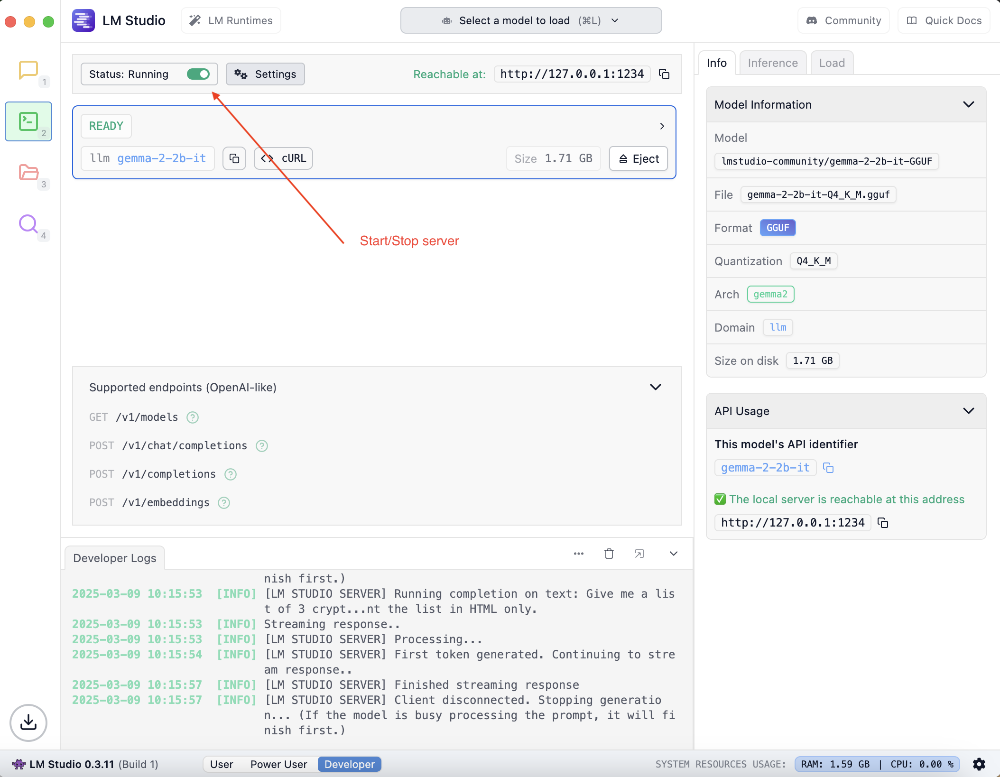

# Using LM Studio

LM Studio is a desktop application that allows you to download, manage, and run local Large Language Models (LLMs) through a graphical user interface.

This guide provides the basic steps for its installation and operation.

## 1. Installation and Setup

To get started on macOS, you have two main options for installation.

### Option A: Install via Homebrew

If you use the Homebrew package manager, you can install LM Studio by running the following command in your terminal:

```shell
brew install --cask lm-studio
```

### Option B: Manual Installation

Alternatively, you can download the application directly from the official website.

1. Navigate to the [LM Studio website](https://lmstudio.ai/).
2. Download the correct version for your Mac (Apple Silicon or Intel).
3. Open the downloaded `.dmg` file and drag the LM Studio application into your `Applications` folder.

## 2. Basic Operations

Once installed, you can begin using the application.

### Starting and Stopping the Model Server

LM Studio includes a built-in server that allows other applications to interact with the models you are running. This server is compatible with the OpenAI API.

To control the server:

1. Navigate to the "Server" tab within the LM Studio application (indicated by the `<-->` icon).
2. Use the `Start Server` button to begin serving a loaded model.
3. Use the `Stop Server` button to shut the server down.

