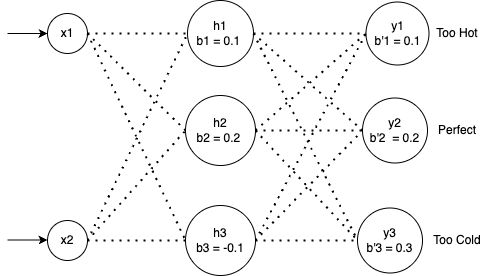

# Neural Network

At its core, a neural network is a composition of simple mathematical operations—primarily linear transformations (matrix multiplications) followed by non-linear functions (activation functions). The "learning" happens by adjusting the numerical parameters (weights and biases) of these transformations to minimise the difference between the network's predictions and the actual desired outputs.

Mathematically, if we have input data x and want to predict output y, a neural network learns a function f such that:

`y ≈ f(x; θ)`

where θ represents all the learnable parameters (weights and biases) in the network.

The architecture is organised in layers. Each layer transforms its input vector through a weighted sum followed by a non-linearity:

```text
h = σ(Wx + b)
```

where:

- `W` is a weight matrix
- `b` is a bias vector
- `σ` is an activation function (like ReLU, sigmoid, or tanh)
- `h` is the output (often called "hidden state" or "activations")

The power of neural networks comes from stacking multiple such layers. Each layer learns to extract increasingly abstract features from the data. The first layer might detect edges in an image, the second layer might combine edges into shapes, and deeper layers might recognise complete objects.

Training a neural network involves:

1. **Forward propagation:** Passing data through the network to get predictions
2. **Loss calculation:** Measuring how wrong the predictions are using a loss function
3. **Backpropagation:** Computing gradients of the loss with respect to each parameter using the chain rule from calculus
4. **Parameter updates:** Adjusting weights and biases in the direction that reduces the loss (typically using gradient descent or variants like Adam)

This process repeats over many iterations (epochs) until the network learns to approximate the underlying function that maps inputs to outputs in your training data.

## Maths Notations

### Variables and Subscripts

`x₁`, `x₂` - These are our input variables. The subscript (the small number) is just an index to distinguish them:

`x₁` = first input (time since boiling)
`x₂` = second input (room temperature)

`hᵢ` - Hidden layer node outputs, where `i` is the node number (`h₁`, `h₂`, `h₃`)
`yᵢ` - Output layer values

### Weights: The Double Subscript

`wᵢⱼ` - This is a weight connecting input `j` to hidden node `i`.
The subscripts tell you **from** and **to**:

First subscript (`i`) = destination node
Second subscript (`j`) = source node

Example: `w₂₁` = weight from input 1 (`x₁`) to hidden node 2 (`h₂`)
Think of it like coordinates: `w[row][column]`

### Bias

`b` or `bᵢ` - Bias is just a constant number added to each node. Think of it as a "baseline" or "threshold adjustment". Each node has its own bias value.

### Matrix Notation

The Dot Product (`·`)
When you see w₁₁·x₁, the dot means multiply:

```text
w₁₁·x₁ = w₁₁ × x₁
```

### Vector Notation

`[x₁]` - Square brackets with items stacked vertically represent a vector (a column of numbers): `[x₂]`

```text
[x₁]   [2 ]
[x₂] = [20]
```

This is a 2×1 vector (2 rows, 1 column).

### Matrix Multiplication

When we write:

```text
[w₁₁  w₁₂]   [x₁]
[w₂₁  w₂₂] · [x₂]
[w₃₁  w₃₂]
```

This means: multiply each row of the matrix with the vector:

```text
Row 1: w₁₁·x₁ + w₁₂·x₂
Row 2: w₂₁·x₁ + w₂₂·x₂
Row 3: w₃₁·x₁ + w₃₂·x₂
```

The result is a new vector:

```text
[w₁₁·x₁ + w₁₂·x₂]
[w₂₁·x₁ + w₂₂·x₂]
[w₃₁·x₁ + w₃₂·x₂]
```

### Vector Addition

When we add two vectors:

```text
[a]   [d]   [a+d]
[b] + [e] = [b+e]
[c]   [f]   [c+f]
```

We just add corresponding elements.

### Complete Example Breakdown

Let's look at this equation again:

```text
h₁ = σ(w₁₁·x₁ + w₁₂·x₂ + b₁)
```

Reading left to right:

1. `h₁` - The output we're calculating for hidden node 1
2. `σ` - A function (activation function) we apply at the end
3. `w₁₁·x₁` - Weight from input 1 to node 1, multiplied by input 1's value
4. `+` - Add
5. `w₁₂·x₂` - Weight from input 2 to node 1, multiplied by input 2's value
6. `+ b₁` - Add the bias for node 1
7. The parentheses mean: do everything inside first, then apply `σ`

With concrete numbers:

```text
h₁ = σ(0.5·2 + (-0.3)·20 + 0.1)
   = σ(1.0 + (-6.0) + 0.1)
   = σ(-4.9)
   = max(0, -4.9)    [ReLU function]
   = 0
```

### The Prime Symbol (')

`w'` (w prime) - This just means "different weights". I used this to distinguish:

- `w` = weights from input layer to hidden layer
- `w'` = weights from hidden layer to output layer

They're completely separate sets of numbers.

### Exponents

`e^y₁` - This means "e to the power of y₁", where e ≈ 2.71828 (Euler's number).
If `y₁ = 2`, then `e^y₁ = e² ≈ 7.389`

### Fractions in Softmax

```text
p₁ = e^y₁ / (e^y₁ + e^y₂ + e^y₃)
```

This is a fraction:

- Numerator (top): `e^y₁`
- Denominator (bottom): `e^y₁ + e^y₂ + e^y₃`

The division (/) means divide the top by the bottom.

This converts raw scores into probabilities that sum to 1.

### Inequalities

`max(0, z)` - This means "the maximum of 0 and z".

- If z = 5, max(0, 5) = 5
- If z = -3, max(0, -3) = 0

This is the ReLU activation function: it keeps positive numbers and zeros out negative ones.

## What is an Activation Function?

An activation function is a mathematical function applied to the output of a neuron (node) that introduces non-linearity into the network.

### Why Do We Need It?

Without activation functions, a neural network would just be a series of matrix multiplications, which would collapse into a single linear transformation. Let me show you:

If we had two layers without activation functions:

```text
h = W₁·x + b₁
y = W₂·h + b₂
```

Substituting h into the second equation:

```text
y = W₂·(W₁·x + b₁) + b₂
y = (W₂·W₁)·x + (W₂·b₁ + b₂)
y = W_combined·x + b_combined
```

This is just one linear transformation! No matter how many layers you stack, without non-linearity, you'd only ever learn linear relationships (straight lines, flat planes). You couldn't learn complex patterns like curves, boundaries, or interactions between features.

The activation function breaks this linearity, allowing the network to learn complex, non-linear patterns.

### Common Activation Functions

#### 1. ReLU (Rectified Linear Unit)

**Formula:** `σ(z) = max(0, z)`

```text
If z < 0: output = 0
If z ≥ 0: output = z
```

**Graph:**

```text
|
4 |       /
3 |      /
2 |     /
1 |    /
0 |___/________
  -2 -1 0 1 2
```

**Why it's popular:** Simple, fast to compute, works well in practice. It allows the network to "turn off" neurons (output 0) when they're not relevant.

#### 2. Sigmoid

**Formula:** `σ(z) = 1 / (1 + e^(-z))`

```text
Output always between 0 and 1
```

**Graph:**

```text
1  |     ___
   |    /
0.5|   /
   |  /
0  |_/________
   -4 -2 0 2 4
```

**Use case:** Often used in the output layer for binary classification (yes/no decisions), because it squashes values to probabilities between 0 and 1.

#### 3. Tanh (Hyperbolic Tangent)

**Formula:** `σ(z) = (e^z - e^(-z)) / (e^z + e^(-z))`

```text
Output always between -1 and 1
```

**Graph:**

```text
 1|     ___
  |    /
 0|___/________
  |  /
-1| /
  -4 -2 0 2 4
```

**Use case:** Similar to sigmoid but centred around 0, which often helps with training.

#### 4. Softmax

**Formula:** For a vector of values `[y₁, y₂, ..., yₙ]`:

```text
pᵢ = e^yᵢ / (e^y₁ + e^y₂ + ... + e^yₙ)
```

**What it does:** Converts a vector of numbers into a probability distribution (all outputs sum to 1).

**Use case:** Output layer for multi-class classification (like our tea example: too hot, perfect, or too cold).

### Concrete Example

Let's see ReLU in action with our tea network:

**Before activation:**

```text
z₁ = 0.5·2 + (-0.3)·20 + 0.1 = -4.9
z₂ = 0.8·2 + 0.2·20 + 0.2 = 5.8
z₃ = -0.4·2 + 0.6·20 - 0.1 = 11.1
```

**After ReLU (max(0, z)):**

```text
h₁ = max(0, -4.9) = 0      ← This neuron is "off"
h₂ = max(0, 5.8) = 5.8     ← This neuron is "on"
h₃ = max(0, 11.1) = 11.1   ← This neuron is "on"
```

The negative value was zeroed out. This is like the neuron deciding "this pattern isn't relevant for this input, so I won't fire".

### Visualising What Activation Functions Do

Imagine you're trying to classify whether a point is inside or outside a circular boundary.

**Without activation (linear only):** You can only draw straight lines to separate regions. You could never draw a circle.

**With activation (non-linear):** The network can learn to bend and curve the decision boundary to match the circular pattern.

## Example

Let's say we want to predict whether tea is at the right temperature to drink based on two inputs:

- `x₁:` Time since boiling (in minutes)
- `x₂:` Room temperature (in °C)

Our output will classify the tea as:

- Too hot (0)
- Perfect (1)
- Too cold (2)

We'll use a 3-layer network:

- **Input layer:** 2 nodes (our two features)
- **Hidden layer:** 3 nodes
- **Output layer:** 3 nodes (one for each category)

This is what the neural network look like:



### The Mathematics

#### Layer 1 → Layer 2 (Input to Hidden)

Each of the 3 hidden nodes computes a weighted sum of the inputs plus a bias:

```text
h₁ = σ(w₁₁·x₁ + w₁₂·x₂ + b₁)
h₂ = σ(w₂₁·x₁ + w₂₂·x₂ + b₂)
h₃ = σ(w₃₁·x₁ + w₃₂·x₂ + b₃)
```

Where:

- `wᵢⱼ` means "weight from input j to hidden node i"
- `bᵢ` is the bias for hidden node i
- `σ` is an activation function (let's use ReLU: σ(z) = max(0, z))

In matrix form:

```text
[h₁]   [w₁₁  w₁₂]   [x₁]   [b₁]
[h₂] = [w₂₁  w₂₂] · [x₂] + [b₂]
[h₃]   [w₃₁  w₃₂]   [  ]   [b₃]

Then apply σ element-wise.
```

#### Layer 2 → Layer 3 (Hidden to Output)

Each of the 3 output nodes does the same:

```text
y₁ = w'₁₁·h₁ + w'₁₂·h₂ + w'₁₃·h₃ + b'₁
y₂ = w'₂₁·h₁ + w'₂₂·h₂ + w'₂₃·h₃ + b'₂
y₃ = w'₃₁·h₁ + w'₃₂·h₂ + w'₃₃·h₃ + b'₃
```

In matrix form:

```text
[y₁]   [w'₁₁  w'₁₂  w'₁₃]   [h₁]   [b'₁]
[y₂] = [w'₂₁  w'₂₂  w'₂₃] · [h₂] + [b'₂]
[y₃]   [w'₃₁  w'₃₂  w'₃₃]   [h₃]   [b'₃]
```

Finally, we apply softmax to convert these to probabilities:

```text
p₁ = e^y₁ / (e^y₁ + e^y₂ + e^y₃)
p₂ = e^y₂ / (e^y₁ + e^y₂ + e^y₃)
p₃ = e^y₃ / (e^y₁ + e^y₂ + e^y₃)
```

The highest probability tells us the prediction.

### Concrete Example with Numbers

Let's say our input is: `x₁ = 2 minutes, x₂ = 20°C`

Suppose after training, our weights are:

**Hidden layer weights:**

```text
W = [0.5   -0.3]    b = [0.1]
    [0.8    0.2]        [0.2]
    [-0.4   0.6]        [-0.1]
```

### Step 1: Compute hidden layer

```text
h₁ = max(0, 0.5·2 + (-0.3)·20 + 0.1) = max(0, 1 - 6 + 0.1) = max(0, -4.9) = 0
h₂ = max(0, 0.8·2 + 0.2·20 + 0.2) = max(0, 1.6 + 4 + 0.2) = 5.8
h₃ = max(0, -0.4·2 + 0.6·20 - 0.1) = max(0, -0.8 + 12 - 0.1) = 11.1
```

**Output layer weights:**

```text
W' = [0.7   0.3   -0.5]    b' = [0.1]
     [0.2   0.9    0.4]         [0.2]
     [-0.3  -0.2   0.8]         [0.3]
```

### Step 2: Compute output layer

```text
y₁ = 0.7·0 + 0.3·5.8 + (-0.5)·11.1 + 0.1 = 0 + 1.74 - 5.55 + 0.1 = -3.71
y₂ = 0.2·0 + 0.9·5.8 + 0.4·11.1 + 0.2 = 0 + 5.22 + 4.44 + 0.2 = 9.86
y₃ = -0.3·0 + (-0.2)·5.8 + 0.8·11.1 + 0.3 = 0 - 1.16 + 8.88 + 0.3 = 8.02
```

### Step 3: Apply softmax

```text
p₁ = e^(-3.71) / (e^(-3.71) + e^9.86 + e^8.02) ≈ 0
p₂ = e^9.86 / (e^(-3.71) + e^9.86 + e^8.02) ≈ 0.86
p₃ = e^8.02 / (e^(-3.71) + e^9.86 + e^8.02) ≈ 0.14
```

**Prediction:** Category 1 (Perfect temperature) with 86% confidence!

The network has learnt that after 2 minutes in a 20°C room, the tea is likely at the perfect temperature. The weights encode this knowledge through the training process.

## References

- [Introduction to Deep Learning](https://www.youtube.com/watch?v=6FkRvTtUc-o)