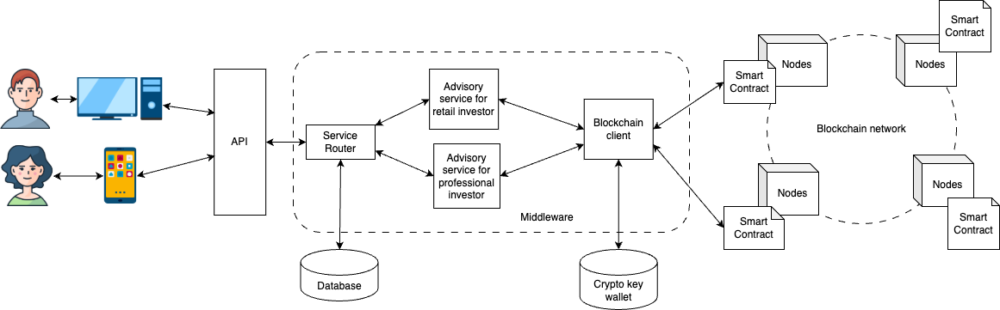
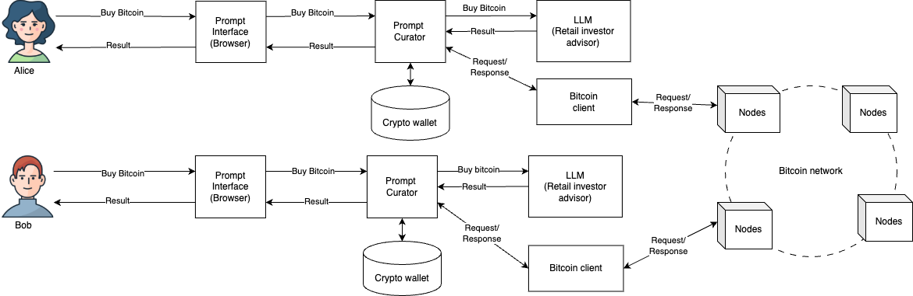

# Is Artificial Intelligence (AI) Disrupting Software Engineering?

Artificial Intelligence (AI) is increasingly cited as a potential disruptor of the software engineering profession.

Given the rise of AI-driven automated code generation, many industry leaders, such as NVIDIA CEO Jensen Huang, have suggested that learning to code is becoming redundant, fueling concerns about a significant decline in traditional coding roles.

Conversely, many software engineers argue that AI cannot fully replace systems built on battle-tested algorithms and established engineering paradigms. While the community acknowledges the existence of AI-generated code, they note that such code is often methodologically flawed and riddled with bugs. Improvement in AI notwithstanding, the prevailing consensus is that human intervention remains necessary.

However, AI could introduce a new paradigm in delivering digital services, making concerns about whether AI-generated code is flawed or production-ready irrelevant.

These contrasting viewpoints raise several key questions:

* Is the software engineering profession facing obsolescence?

* Is AI's impact on the profession overstated?

* Will software engineering evolve into a collaborative partnership between AI and humans?

I will explore these questions by contrasting traditional (Web2) and AI-driven (prompt-based) architectures and the impact of AI-automated code generation.

## A Case Study of Web2 vs Prompt-Based Architecture

To illustrate how AI-driven systems differ from traditional Web2 architecture, I will consider a scenario involving two personas: Alice and Bob, both looking to buy cryptocurrency through a hypothetical cryptocurrency exchange. Alice is a professional investor, while Bob is a retail investor. Financial regulations require them to be treated differently based on risk profiles.

### Web2 Architectural Pattern

Consider how Alice and Bob interact with a cryptocurrency exchange built using a Web2 architectural pattern:

* Alice and Bob navigate through predefined user interfaces.

* The exchange directs them to different pages based on their risk profiles.

* When they execute a trade, their transactions are routed through predefined services tailored to their respective profiles.

The internal architecture of a Web2-based crypto exchange follows a pattern summarised in Figure 1. Developing such an exchange requires a team of specialists: UI developers, middleware engineers, database experts, and DevOps professionals. Since these applications are often deployed in the cloud, additional cloud infrastructure specialists are also involved.

<figure>

<figcaption>Figure 1: Web2 Architecture </figcaption>
</figure>

While functional and well-established, this model offers limited flexibility. Alice and Bob must conform to a predefined workflow and interface, restricting their ability to evolve their trading strategies dynamically. Any feature enhancements require careful engineering efforts. However, the Web2 pattern has been battle-tested over the years, accumulating significant expertise to ensure its reliability.

### Prompt-Based AI Architecture

A prompt-based AI system is one where users engage the system through a natural language statement or a prompt. Imagine an AI-driven, prompt-based system where Alice and Bob interact with a large language model (LLM) to invest in cryptocurrencies. The process could look like this:

* Alice or Bob requests a list of cryptocurrencies with this prompt: “List cryptocurrencies for me to buy and present the list in table form.”

* A prompt curator intercepts the prompt from Alice or Bob and enhances the original by instructing the LLM to operate in two roles per financial regulations: a retail advisor for Bob and a professional advisor for Alice. The prompt could be this for Alice: "LLM, you are now a professional investor advisor and provide a list of cryptocurrencies appropriate for Alice risk profile in HTML tabular format".

* Alice or Bob initiates a trade with this prompt: “Buy Bitcoin.” The system engages the LLM to advise Alice or Bob about the risk of purchasing a given cryptocurrency. The LLM might determine that Alice's investment in Bitcoin is suitable based on her risk profile, while Bob is advised to consider the risks.

* The prompt curator interacts with a crypto wallet to execute the trade on a cryptocurrency node.

The internal architecture of a prompt-based system is summarised in Figures 2 and 3.

<figure>

<figcaption>Figure 2: List Crypto</figcaption>
</figure>

<figure>

<figcaption>Figure 3: Buy Crypto</figcaption>
</figure>

In Figure 2, the LLM generates code (i.e., HTML) to enable prompt interfaces to render presentations directly. This approach of LLM-driven UI rendering is known as a **malleable application**. It grants Alice and Bob greater flexibility and control through prompts. Rather than navigating a rigid interface, they interact with a dynamic system that adapts to their needs. For example, the LLM could learn from Bob's trading pattern and adjust its advice dynamically without complex re-engineering. Furthermore, the prompt curator can enhance user prompts, ensuring that the LLM delivers accurate and contextually relevant responses.

## Malleable Application Architectures: AI’s Potential Shift

This case study highlights how AI introduces the concept of a **malleable application architecture**, where applications are no longer static constructs but adaptable systems capable of evolving based on user interactions. In this paradigm, the LLM provides business logic services typically found in Web2. The prompt curator serves as the equivalent of an API in Web2, but unlike Web2’s rigid API calls. User interactions are conducted through natural language prompts. The software engineers could still have a role in designing and implementing these curated prompts and its interaction with other systems like cryptographic wallet or databases. However, traditional engineering principles don't apply when implementing LLMs and this is an aspect software engineering practices is expected to change.

### Key takeaway

Here are my key takeways when contrasting web2 and prompt-base archtiecture.

| Aspect | Web2 | Prompt Architecture |
| --- | --- | --- |
| User | Guided interaction | User driven |
| UI | Fixed layout | Malleable |
| Middleware | Rules bound | Knowledge driven | 

## AI-Generate Code: Coding or Engineering?

AI-powered tools marketed as developer assistants aim to take over the coder's role. However, to fully appreciate where these AI-powered tools fit into the software engineering profession, we need to consider two aspects of the profession:

* The distinction between engineering and coding.

* The difference between malleable applications and generated code.

When software engineers undertake a task, they play two roles: engineer and coder. The engineer's task is to translate business requirements into functional models. The coder translates functional models into source code using a programming language.

AI-powered tools marketed as software engineering assistants are designed to augment the coding process. These tools enable software engineers to express engineering thought processes via natural language prompts, generating code for the engineer to inspect. The coder’s role is minimised and may even become redundant. However, the codes generated by these tools are for human consumption and are not the same as malleable applications.

Malleable applications generate UI elements for end users rather than software engineers. While this type of application is still in its early stage of development, future LLM and computing platforms could have capabilities that are optimised for each other.

### The Limitations of AI-Generated Code

It is worth noting that programming languages were created principally to be human-readable. Many of these languages require compilation for execution on computational platforms, and others, such as HTML and Javascript, can be interpreted by platforms directly. These languages must also be tuned to ensure that executables are optimised for the target platform. This requires a skilled software engineer to write codes accordingly. Does AI have the necessary cognitive skills to perform such tasks?

Many programming languages have been created. My estimate is about 100, if not more. Figure 4 summarises the range of programming languages and their fit in the Web2 architecture. Expecting AI to cover all these languages could be a tall order. How well each language is supported depends on the level of investment by the AI tools provider.

<figure>

<figcaption>Figure 4: Programming Languages</figcaption>
</figure>

According to many software engineers, the principal criticisms of AI-generated code are:

* Generated codes do not follow proper engineering practices developed over the years.

* The lack of a deliberate and considerate approach to producing code accumulates technical debt, making generated codes unreadable by humans.

Conversely, proponents of such tools argue that they help software engineers achieve productivity and thus outweigh the downside of occasional problems. In any case, as AI progresses, such tools will inevitably improve.

### A Fad or a Fundamental Shift?

Since programming languages are primarily designed for human readability, the sheer variety of languages and the potential rise of malleable applications raise a fundamental question:  Is using AI to generate human-readable code an optimal use of AI? Does AI-generated code represent a fundamental shift in the AI landscape?

Some may argue that software engineers must scrutinise code before deployment to ensure reliability and security, necessitating human involvement. If AI allows engineers to focus on higher-level problem-solving—such as translating business requirements into AI prompts—this could be a more productive shift than having engineers manually write code. But this raises another question: Do we still need to support many programming languages?

Some languages, such as JavaScript, Java, and C#, rely on frameworks (e.g., React, Spring Boot) to abstract complexity and reduce cognitive load. Frameworks were created to relieve coders from having to type boilerplate codes. If AI is meant to generate code, what is the rationale for retaining complex languages and their frameworks? Would it not be more logical for the software engineering profession to standardise on languages with minimal footprints, thereby reducing the complexity AI must handle? As developers shift from writing code to supervising AI-generated solutions. Standardising programming languages would simplify AI training and improve the accuracy of AI-generated code by reducing variability and unnecessary complexity. Without such an effort, AI code generation may ultimately be a short-lived trend rather than a lasting transformation. Otherwise, the investment in training AI to cope with multiple languages may not be commercially viable. 

Moreover, if the future of AI-driven development leans toward a prompt-oriented paradigm—particularly, malleable applications—the need for AI-generated code to be compiled into traditional executables seems increasingly redundant. A much more worthwhile investment may be for LLM to tune executable codes for interaction with user interfaces. 

## Conclusion

Predicting the long-term impact of AI is as uncertain as my previous attempt to forecast a world dominated by Web3 (blockchain-based technology). The Web3 promise of efficiency through smart contracts replacing traditional architecture did not enjoy widespread adoption. It remains confined to cryptocurrency rather than achieving widespread enterprise adoption. A principal reason is a clear return on investment in the cryptocurrency domain, whereas the deployment of Web3 could not justify investment in the technology. It also met with resistance from traditional software engineering practitioners.

Like Web3, AI adoption may depend on economic incentives and resistance to change. For AI, where is the equivalent of cryptocurrency financial appeal?

If we focus on AI disrupting the software engineering profession, will AI-generated code be that transformation solution? I am sceptical that code generation is the one. Arguments for AI-generated code miss the bigger picture:

* It is hard to imagine training AI to generate code for many programming languages is economically feasible.

* A prompt-oriented and malleable application architecture seems the logical endpoint; if so, AI-generated code offers little long-term value.

Will future digital systems be entirely prompt-oriented? 

Given that traditional banking still relies on COBOL, resistance to change suggests Web2 systems will likely coexist with prompt-driven architectures. What this hybrid landscape will look like is uncertain. However, for software engineers, embracing a prompt-based mindset is no longer optional but essential. Focusing on the deficiencies of AI-generated code solutions and extrapolating from that to dismiss the impact of AI on the software engineering profession may be foolish.

